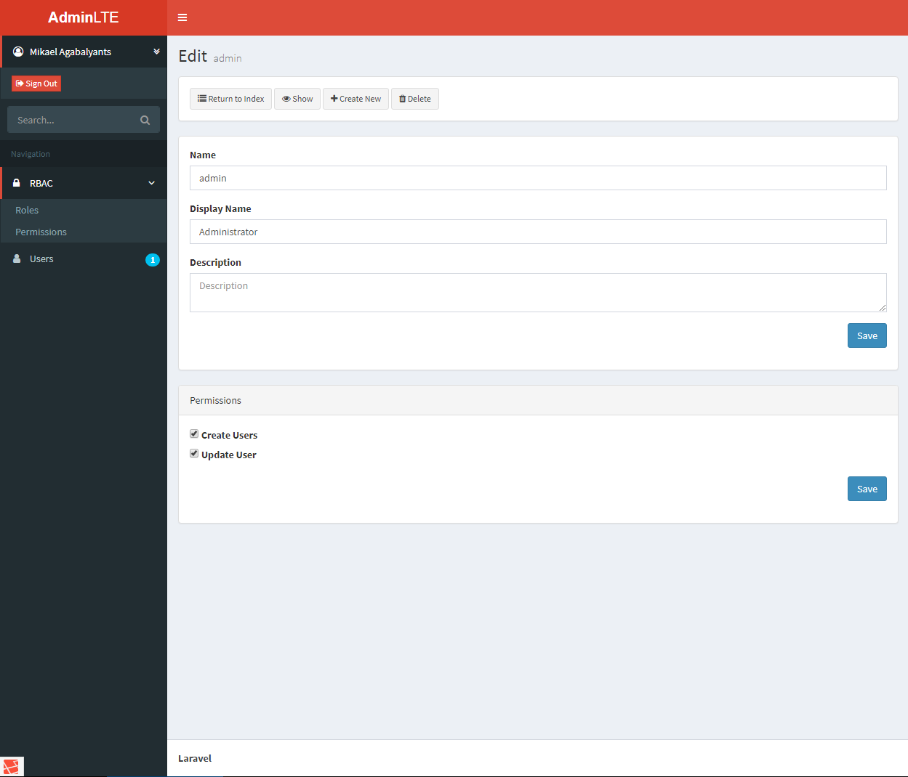

# Laravel starter kit with admin

## What's inside?

- Laravel 5.5 dev version

- Fix "1071 Specified key was too long; max key length is 767 bytes" error

- Move Uses Model to Models folder and App\Models namespace

- santigarcor/laratrust:4.0.* and setup it

- barryvdh/laravel-debugbar:~3.0

- make:auth

- spatie/laravel-backup:dev-laravel-55 and setup it

- Russian traslatian for default Laravel lang files

- `php artisan preset none`

- barryvdh/laravel-ide-helper and setup it 

- [AdminLTE integration](#adminlte-integration)

- Include external Bootstrap (from npm)

- Some app.layouts, home and welcome blade file changes

- Add less css to webpack

- [Create resources](#create-resources)

- Add actions view part with show/delete/edit/create new/return to index buttons to easy use in other views 

#### AdminLTE integration

##### Integration of starter.html to laravel blade's files

- Create views and slice to parth like header, footer, sidebars etc.
- Create some layouts like default starter layout and auth layout 
- Modify webpack.js to copy admin-lte plugins, images, css, js

##### Create additional auth views

- Merge AdminLTE login and register html with Laravel make:auth views
- Additionaly create password reset and password email views with Laravel make:auth views and on the base AdminLTE login html

##### Localization

- Localize auth views (add @lang on blade templates and create admin-lte localization file)
- Localize some admin-lte strings like sign out
- Add ru translation

##### Other small things

- Add CSRF token to forms
- Make Sign Out button workable
- Change name to {{ Auth::user()->name }} (your name)
- Edit company name in footer
- Include external Bootstrap, iCheck and other libraries from npm

#### Create resources

- Create Role and Permission models
- Create User, Role and Permission controllers and requests
- Create User, Role and Permission views
- Add some translations

## Installation

### Via Composer

1) `composer create-project njxqlus/getlaravel myproject`

1) `npm install`

1) Setup database

1) `php artisan migrate`

### Via git clone

1) `git clone https://github.com/njxqlus/getlaravel-admin.git myproject`

1) Copy and rename .env.example to .env

1) `php artisan key:generate`

1) `composer install`

1) `npm install`

1) Setup database

1) `php artisan migrate`
 
## Backups Setup

1) Setup `MYSQLDUMP_PATH` in .env file for MySQL backups

1) Setup CRON on server like: `* * * * * php /path/to/artisan schedule:run >> /dev/null 2>&1`

## IDE Helper Setup

1) `php artisan ide-helper:meta`

1) `php artisan ide-helper:model`

1) `php artisan ide-helper:generate`

## Usage

Let's build something awesome!

Admin based on `/cp` route

## What's next?

- Setup permissions

## Credits

- [Mikael Agabalyants](https://github.com/njxqlus/)
- [All contributors](https://github.com/njxqlus/laravel-helpers/graphs/contributors)
